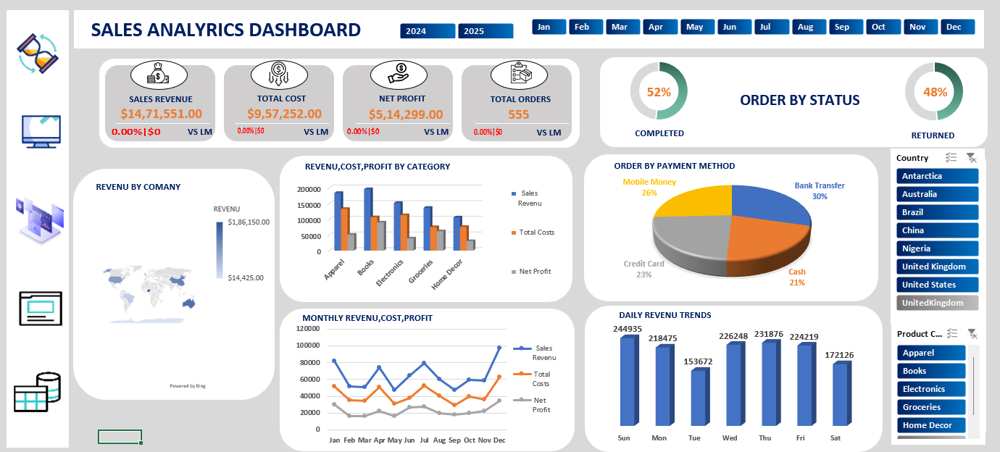

# Excel-Sales-Analysis-Dashboard
An interactive Sales Analysis Dashboard built in Excel using VBA, Macros, Pivot Tables, and Charts. This project helps in analyzing sales performance with filters, KPIs, and automated report generation. Built for learning and showcasing Excel automation and data visualization skills.
# Excel Sales Analysis Dashboard

An interactive Sales Analysis Dashboard built in Excel using VBA, Macros, Pivot Tables, and Charts.  
It enables dynamic sales analysis through filters, key metrics, and automated report generation.

## 📈 Features

- Dynamic Sales KPIs (Total Sales, Total Units, Average Sale Price)
- Interactive Filters (By Product, Region, Time Period)
- Pivot Table-based Summaries
- Automated Charts & Graphs
- VBA Macros for Refresh and Navigation
- User-friendly Interface

## 🛠️ Tools & Technologies Used

- Microsoft Excel (.xlsm)
- VBA (Visual Basic for Applications)
- Pivot Tables and Pivot Charts
- Macros (Button based actions)
- Excel Form Controls

## 🚀 How to Use

1. Download or Clone the repository.
2. Open the `excelsalesanalysis.xlsm` file in Microsoft Excel.
3. Enable **Content** and **Macros** when prompted.
4. Use the slicers, filters, and buttons to interact with the dashboard.
5. View KPIs, trends, and detailed analysis easily!

## 📷 Dashboard Preview

## 🌟 Future Improvements (Optional)

- Add dynamic data import from external files
- Improve dashboard styling with modern Excel design
- Add more filters (example: Customer Segment)

---

## Owner

 If any typt od query you can ask on parlhadjadhav7@gmail.com or Linkdeln Pralhad jadhav

---
